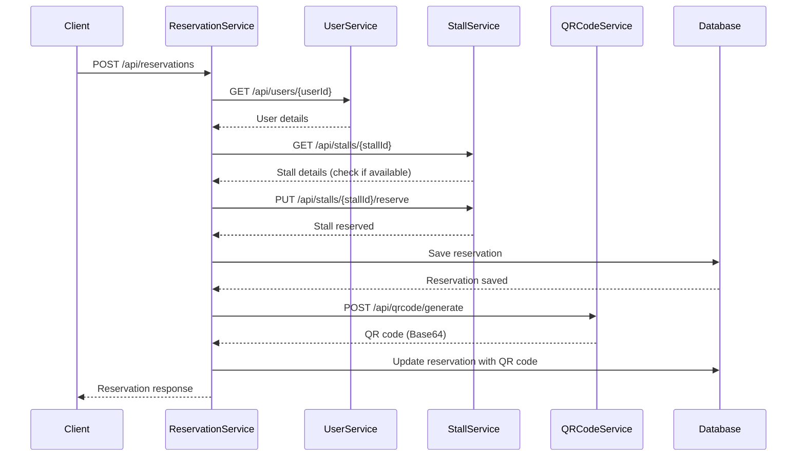
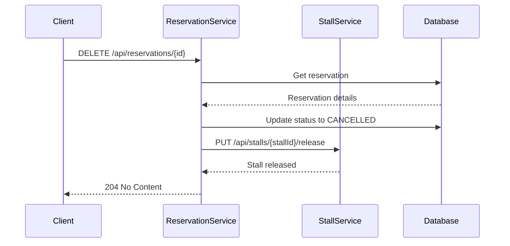

# External API Requirements for Reservation Service

## Overview
This document details all external APIs required by the **Reservation Service** to function properly. These are the microservices that must be running and accessible for the Reservation Service to operate at full capacity.

**Last Updated:** November 9, 2025

---

## Service Dependencies Summary

| Service Name | Base URL | Port | Status | Critical |
|-------------|----------|------|--------|----------|
| **User Service** | http://localhost:8081 | 8081 | Required | ✅ Yes |
| **Stall Service** | http://localhost:8082 | 8082 | Required | ✅ Yes |
| **QR Code Service** | http://localhost:8083 | 8083 | Optional | ⚠️ No |

---

## 1. User Service API

**Base URL:** `http://localhost:8081`  
**Purpose:** Fetch user information for reservations  
**Configuration Property:** `services.user-service.url`

### 1.1 Get User by ID

**Endpoint:** `GET /api/users/{userId}`

**Description:** Retrieve user details by user ID

**Path Parameters:**
| Parameter | Type | Required | Description |
|-----------|------|----------|-------------|
| userId | Long | Yes | The unique identifier of the user |

**Request Example:**
```bash
curl -X GET http://localhost:8081/api/users/1 \
  -H "Content-Type: application/json"
```

**Response (200 OK):**
```json
{
  "id": 1,
  "email": "john.doe@example.com",
  "name": "John Doe",
  "businessName": "Tech Innovations Inc."
}
```

**Response Schema:**
```json
{
  "id": "Long - Unique user identifier",
  "email": "String - User's email address",
  "name": "String - User's full name",
  "businessName": "String - User's business/company name"
}
```

**Error Responses:**
| Status Code | Description |
|-------------|-------------|
| 404 | User not found |
| 500 | Internal server error |

**Usage in Reservation Service:**
- Called when creating a new reservation
- Called when fetching reservation details
- Used to validate user existence
- Used to populate user information in reservation responses

---

## 2. Stall Service API

**Base URL:** `http://localhost:8082`  
**Purpose:** Manage stall information and availability  
**Configuration Property:** `services.stall-service.url`

### 2.1 Get Stall by ID

**Endpoint:** `GET /api/stalls/{stallId}`

**Description:** Retrieve stall details by stall ID

**Path Parameters:**
| Parameter | Type | Required | Description |
|-----------|------|----------|-------------|
| stallId | Long | Yes | The unique identifier of the stall |

**Request Example:**
```bash
curl -X GET http://localhost:8082/api/stalls/5 \
  -H "Content-Type: application/json"
```

**Response (200 OK):**
```json
{
  "id": 5,
  "stallCode": "ST-005",
  "size": "Medium",
  "price": 5000.00,
  "isReserved": false
}
```

**Response Schema:**
```json
{
  "id": "Long - Unique stall identifier",
  "stallCode": "String - Stall code/number (e.g., ST-005)",
  "size": "String - Stall size (Small/Medium/Large)",
  "price": "Double - Stall rental price",
  "isReserved": "Boolean - Reservation status (true/false)"
}
```

**Error Responses:**
| Status Code | Description |
|-------------|-------------|
| 404 | Stall not found |
| 500 | Internal server error |

**Usage in Reservation Service:**
- Called when creating a new reservation
- Called when fetching reservation details
- Used to validate stall existence
- Used to check stall availability before reservation

---

### 2.2 Reserve Stall

**Endpoint:** `PUT /api/stalls/{stallId}/reserve`

**Description:** Mark a stall as reserved

**Path Parameters:**
| Parameter | Type | Required | Description |
|-----------|------|----------|-------------|
| stallId | Long | Yes | The unique identifier of the stall to reserve |

**Headers:**
| Header | Value | Required |
|--------|-------|----------|
| Content-Type | application/json | Yes |

**Request Example:**
```bash
curl -X PUT http://localhost:8082/api/stalls/5/reserve \
  -H "Content-Type: application/json"
```

**Response (200 OK):**
```json
{
  "id": 5,
  "stallCode": "ST-005",
  "size": "Medium",
  "price": 5000.00,
  "isReserved": true
}
```

**Response Schema:**
```json
{
  "id": "Long - Unique stall identifier",
  "stallCode": "String - Stall code/number",
  "size": "String - Stall size",
  "price": "Double - Stall rental price",
  "isReserved": "Boolean - Should be true after reservation"
}
```

**Error Responses:**
| Status Code | Description |
|-------------|-------------|
| 400 | Stall already reserved |
| 404 | Stall not found |
| 500 | Internal server error |

**Usage in Reservation Service:**
- Called when creating a new reservation
- Updates stall status to reserved
- Prevents double-booking

**Important Notes:**
- This endpoint should be idempotent
- Should return success even if already reserved (or appropriate error)
- Must update the `isReserved` field to `true`

---

### 2.3 Release Stall

**Endpoint:** `PUT /api/stalls/{stallId}/release`

**Description:** Mark a stall as available (release reservation)

**Path Parameters:**
| Parameter | Type | Required | Description |
|-----------|------|----------|-------------|
| stallId | Long | Yes | The unique identifier of the stall to release |

**Headers:**
| Header | Value | Required |
|--------|-------|----------|
| Content-Type | application/json | Yes |

**Request Example:**
```bash
curl -X PUT http://localhost:8082/api/stalls/5/release \
  -H "Content-Type: application/json"
```

**Response (200 OK):**
```json
{
  "id": 5,
  "stallCode": "ST-005",
  "size": "Medium",
  "price": 5000.00,
  "isReserved": false
}
```

**Response Schema:**
```json
{
  "id": "Long - Unique stall identifier",
  "stallCode": "String - Stall code/number",
  "size": "String - Stall size",
  "price": "Double - Stall rental price",
  "isReserved": "Boolean - Should be false after release"
}
```

**Error Responses:**
| Status Code | Description |
|-------------|-------------|
| 404 | Stall not found |
| 500 | Internal server error |

**Usage in Reservation Service:**
- Called when canceling a reservation
- Updates stall status to available
- Allows stall to be reserved again

**Important Notes:**
- This endpoint should be idempotent
- Should handle case where stall is already available
- Must update the `isReserved` field to `false`

---

## 3. QR Code Service API

**Base URL:** `http://localhost:8083`  
**Purpose:** Generate QR codes for reservations  
**Configuration Property:** `services.qrcode-service.url`  
**Criticality:** Optional (reservations can be created without QR codes)

### 3.1 Generate QR Code

**Endpoint:** `POST /api/qrcode/generate`

**Description:** Generate a QR code for a reservation

**Headers:**
| Header | Value | Required |
|--------|-------|----------|
| Content-Type | application/json | Yes |

**Request Body:**
```json
{
  "reservationId": 1,
  "userName": "John Doe",
  "stallCode": "ST-005"
}
```

**Request Schema:**
```json
{
  "reservationId": "Long - Unique reservation identifier",
  "userName": "String - Name of the user who made the reservation",
  "stallCode": "String - Code of the reserved stall"
}
```

**Request Example:**
```bash
curl -X POST http://localhost:8083/api/qrcode/generate \
  -H "Content-Type: application/json" \
  -d '{
    "reservationId": 1,
    "userName": "John Doe",
    "stallCode": "ST-005"
  }'
```

**Response (200 OK):**
```json
{
  "qrCodeBase64": "iVBORw0KGgoAAAANSUhEUgAAASwAAAEsCAYAAAB5fY51AAAAAXNSR0IArs4c6QAA..."
}
```

**Response Schema:**
```json
{
  "qrCodeBase64": "String - Base64 encoded QR code image (PNG format)"
}
```

**Error Responses:**
| Status Code | Description |
|-------------|-------------|
| 400 | Invalid request body |
| 500 | Failed to generate QR code |

**Usage in Reservation Service:**
- Called after successfully creating a reservation
- QR code is stored in the reservation record
- If QR code generation fails, reservation is still created (QR code is optional)

**Important Notes:**
- This service is **optional** - reservations work without it
- QR code generation errors are logged but don't fail the reservation
- The QR code should encode reservation information for easy scanning
- Image format should be PNG, encoded in Base64

---

## Configuration

### Application Properties
Configure the service URLs in `src/main/resources/application.properties`:

```properties
# Microservices Configuration - External Service URLs
services.user-service.url=http://localhost:8081
services.stall-service.url=http://localhost:8082
services.qrcode-service.url=http://localhost:8083
```

### Environment Variables (Alternative)
You can also set these as environment variables:

```bash
export SERVICES_USER_SERVICE_URL=http://localhost:8081
export SERVICES_STALL_SERVICE_URL=http://localhost:8082
export SERVICES_QRCODE_SERVICE_URL=http://localhost:8083
```

### Docker Compose Configuration
For containerized deployments:

```yaml
services:
  reservation-service:
    environment:
      - SERVICES_USER_SERVICE_URL=http://user-service:8081
      - SERVICES_STALL_SERVICE_URL=http://stall-service:8082
      - SERVICES_QRCODE_SERVICE_URL=http://qrcode-service:8083
```

---

## API Call Sequence

### Creating a Reservation



### Canceling a Reservation



---

## Error Handling

### Service Unavailable
When external services are unavailable, the Reservation Service will:

1. **Log the error** with details
2. **Throw a RuntimeException** with a descriptive message
3. **Return HTTP 500** to the client with an error response

**Example Error Response:**
```json
{
  "status": 500,
  "message": "Failed to fetch user from User Service",
  "error": "Internal Server Error",
  "timestamp": "2025-11-09T17:30:00.000+00:00",
  "path": "/api/reservations"
}
```

### Timeout Configuration
Recommended timeout settings for RestTemplate:

```java
@Bean
public RestTemplate restTemplate() {
    SimpleClientHttpRequestFactory factory = new SimpleClientHttpRequestFactory();
    factory.setConnectTimeout(3000);  // 3 seconds
    factory.setReadTimeout(5000);     // 5 seconds
    return new RestTemplate(factory);
}
```

---

## Testing External APIs

### Health Check Endpoints
Each service should implement a health check endpoint:

```bash
# User Service
curl http://localhost:8081/actuator/health

# Stall Service
curl http://localhost:8082/actuator/health

# QR Code Service
curl http://localhost:8083/actuator/health
```

### Mock Services for Testing
For development and testing without running all services, you can:

1. **Use WireMock** to mock external services
2. **Use JSON Server** for quick mock APIs
3. **Implement test profiles** with mock beans

**Example Mock Response with WireMock:**
```java
stubFor(get(urlEqualTo("/api/users/1"))
    .willReturn(aResponse()
        .withStatus(200)
        .withHeader("Content-Type", "application/json")
        .withBody("{\"id\":1,\"name\":\"John Doe\",\"email\":\"john@example.com\",\"businessName\":\"Tech Corp\"}")));
```

---

## Service Contracts

### API Versioning
All services should use API versioning:
- Current version: `v1`
- Base path: `/api/v1/...` (optional but recommended)

### Content Type
All requests and responses use:
- **Content-Type:** `application/json`
- **Accept:** `application/json`

### Status Codes
Standard HTTP status codes:
- `200 OK` - Successful GET/PUT request
- `201 Created` - Successful POST request
- `204 No Content` - Successful DELETE request
- `400 Bad Request` - Invalid request
- `404 Not Found` - Resource not found
- `500 Internal Server Error` - Server error

---

## Security Considerations

### Authentication
If services require authentication:
- Add JWT token forwarding in RestTemplate
- Configure service-to-service authentication
- Implement API keys for service communication

### Network Security
- Use HTTPS in production
- Implement mutual TLS (mTLS) for service-to-service communication
- Use API Gateway for centralized authentication

---

## Performance Considerations

### Caching
Consider caching frequently accessed data:
- User information (with TTL)
- Stall details (with cache invalidation)

### Circuit Breaker
Implement circuit breaker pattern (Resilience4j):
```java
@CircuitBreaker(name = "userService", fallbackMethod = "getUserFallback")
public UserDto getUserById(Long userId) {
    // API call
}
```

### Retry Logic
Add retry mechanism for transient failures:
```java
@Retry(name = "userService", maxAttempts = 3)
public UserDto getUserById(Long userId) {
    // API call
}
```

---

## Monitoring & Observability

### Metrics to Track
- API call success/failure rates
- Response times for each external service
- Circuit breaker state changes
- Retry attempts

### Logging
Log all external service calls:
```
DEBUG - Fetching user from User Service: http://localhost:8081/api/users/1
ERROR - Failed to fetch user with ID 1: Connection refused
```

---

## Quick Start Checklist

Before running Reservation Service, ensure:

- [ ] **User Service** is running on port 8081
- [ ] **Stall Service** is running on port 8082
- [ ] **QR Code Service** is running on port 8083 (optional)
- [ ] All services are accessible from Reservation Service
- [ ] Required endpoints are implemented in each service
- [ ] Database is properly configured for each service
- [ ] Health check endpoints return 200 OK

---

## Support & Contact

For issues with external service integration:
1. Check service logs
2. Verify service URLs in configuration
3. Test services individually with curl/Postman
4. Check network connectivity
5. Verify response schemas match expected DTOs

---

## Changelog

| Date | Version | Changes |
|------|---------|---------|
| 2025-11-09 | 1.0 | Initial documentation |

---

## Appendix: Complete API Examples

### Example 1: Complete Reservation Flow

**Step 1: Verify User Exists**
```bash
curl -X GET http://localhost:8081/api/users/1
```

**Step 2: Get Stall Details**
```bash
curl -X GET http://localhost:8082/api/stalls/5
```

**Step 3: Reserve the Stall**
```bash
curl -X PUT http://localhost:8082/api/stalls/5/reserve \
  -H "Content-Type: application/json"
```

**Step 4: Create Reservation**
```bash
curl -X POST http://localhost:8080/api/reservations \
  -H "Content-Type: application/json" \
  -H "X-User-Id: 1" \
  -d '{
    "stallId": 5
  }'
```

**Step 5: Generate QR Code**
```bash
curl -X POST http://localhost:8083/api/qrcode/generate \
  -H "Content-Type: application/json" \
  -d '{
    "reservationId": 1,
    "userName": "John Doe",
    "stallCode": "ST-005"
  }'
```

### Example 2: Cancel Reservation Flow

**Step 1: Cancel Reservation**
```bash
curl -X DELETE http://localhost:8080/api/reservations/1 \
  -H "X-User-Id: 1"
```

**Step 2: Release Stall (Automatic)**
```bash
# This is called automatically by Reservation Service
curl -X PUT http://localhost:8082/api/stalls/5/release \
  -H "Content-Type: application/json"
```

---

**End of External API Requirements Documentation**
